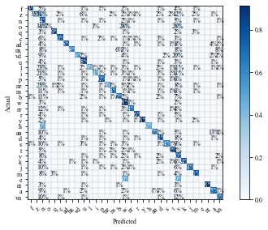

# BITCS_NLP-Project1
实现分词、词性标注以及NER
# 项目概况

本项目是一个使用 python 实现的词法分析工具包，集成了分词，词性标注以及命名实体识别等功能。项目处理流程如上图所示。

对于分词，本项目提供了三种不同的算法实现：隐马尔可夫(HMM)，N-最短路和逆向最大匹配。其中隐马尔可夫是基于统计的算法，而 N-最短路及逆向最大匹配均是基于词典的算法。

对于词性标注，本项目提供了两种算法实现，HMM 和条件随机场(CRF++)。其中 CRF++使用 python 作为胶水语言，调用底层的开源 C++接口，拥有较高的效率。

对于命名实体识别(NER)，本项目同样提供了 HMM 和 CRF++的两种实现。


# 工具包ChenxiLexicalAnalysis功能展示
## 运行环境
### numpy 1.18.5

### CRFPP

### matplotlib 3.2.2

### sklearn.metrics

## 零、模块导入


```python
from NER import NER, BatchNER, DemoCRFNER, DemoHMMNER
from Pos import Tagging, BatchTagging, PosTagDemo
from Seg import DictSegment, StatisticSegment, BatchSeg, DemoSeg
```

## 一、分词
使用了HMM,N-最短路，随机化N-最短路以及逆向最大匹配等四种分词算法

### 1.1 单句分词调用接口
输入一个字符串，打印分词结果


```python
s='于是我们奋力前进,却如同逆水行舟,注定要不断地退回过去。'
```


```python
#基于辞典的方法
#反向最大匹配
print(DictSegment(s,mode='RMM'))

#N-最短路分词
print(DictSegment(s,mode='DAG'))

#N-最短路分词(随机回溯路径)
print(DictSegment(s,mode='RDAG'))

#基于统计的方法
#隐马尔可夫分词
print(StatisticSegment(s))
```

    于是 我们 奋力 前进 , 却 如同 逆水行舟 , 注定 要 不断 地 退回 过去 。 
    于是 我们 奋力 前进 , 却 如同 逆水行舟 , 注定 要 不断 地 退回 过去 。 
    于是 我们 奋力 前进 , 却 如同 逆水行舟 , 注定 要 不断 地 退回 过去 。 
    于 是 我们 奋力 前 进, 却 如同 逆水 行舟 , 注定 要 不断 地退 回过 去 。 


### 1.2 批量分词调用接口

输入一个文本文件，输出分词结果，保存在txt文件中

分词结果请在路径./result/Seg文件夹下的相关文件中查看


```python
#原始文本文件所在路径
inpath='./corpus/segment/test5_SEG+POSTAG.txt'
```


```python
outpath='./result/Seg/HMMSegResult.txt'
BatchSeg(mode='HMM',path=inpath,outpath=outpath)

outpath='./result/Seg/DAGSegResult.txt'
BatchSeg(mode='DAG',path=inpath,outpath=outpath)
                 
outpath='./result/Seg/RDAGSegResult.txt'
BatchSeg(mode='RDAG',path=inpath,outpath=outpath)

outpath='./result/Seg/HMMSegResult.txt'
BatchSeg(mode='HMM',path=inpath,outpath=outpath)
```

    Using HMM
    Training complete in 0m 2s
    segment speed is 257.1079779823241 kb/s
    Using DAG
    Training complete in 0m 2s
    segment speed is 208.87647442638806 kb/s
    Using SDAG
    Training complete in 0m 3s
    segment speed is 202.9100693401948 kb/s
    Using HMM
    Training complete in 0m 2s
    segment speed is 254.8305414489906 kb/s


### 1.3 分词算法性能测评
以下分别展示本项目所实现的4种分词方法：

HMM,N-最短路，随机化N-最短路以及逆向最大匹配的性能

默认测评文本文件为corpus/segment/test5_SEG+POSTAG.txt，大小519kb

内容来自人民日报语料库的后4296行


```python
DemoSeg()
```

    Using HMM
    Training complete in 0m 3s
    segment speed is 203.43079548364307 kb/s
    Precision=80.39258102744493,Recall=80.55547701848134,F1=80.47394658921334,OOVRecall=52.351331176909675,IVRecall=81.66581772588356
    
    Using DAG
    Training complete in 0m 2s
    segment speed is 223.72384761102927 kb/s
    Precision=89.98014163817884,Recall=93.51974893268115,F1=91.71580679150415,OOVRecall=2.114953968648918,IVRecall=97.11817255700964
    
    Using RandomDAG
    Training complete in 0m 2s
    segment speed is 218.73017029019147 kb/s
    Precision=89.88855741242826,Recall=93.42456199873712,F1=91.62245595874077,OOVRecall=2.114953968648918,IVRecall=97.01923830420813
    
    Using RMM
    Training complete in 0m 1s
    segment speed is 689.2554481051873 kb/s
    Precision=89.87574656286536,Recall=93.46037490457746,F1=91.63301701117138,OOVRecall=2.114953968648918,IVRecall=97.05646109239088


## 二、词性标注
使用了HMM和CRF++两种算法

### 2.1 单句标注调用接口
输入一个预分词字符串，打印词性标注结果


```python
#预分词字符串
s='多 年 以后 ， 奥雷连诺 上校 站 在 行刑队 面前 ， 准 会 想起 父亲 带 他 去 参观 冰块 的 那个 遥远 的 下午 。'
```


```python
#HMM词性标注
print(Tagging(s,mode='HMM'))

#CRF词性标注
print(Tagging(s,mode='CRF'))
```

    多/m 年/q 以后/f ，/w 奥雷连诺/n 上校/w 站/v 在/p 行刑队/n 面前/f ，/w 准/v 会/v 想起/v 父亲/n 带/v 他/r 去/v 参观/v 冰块/n 的/u 那个/r 遥远/a 的/u 下午/t 。/w 
    多/a 年/q 以后/f ，/w 奥雷连诺/v 上校/n 站/v 在/p 行刑队/n 面前/f ，/w 准/v 会/v 想起/v 父亲/r 带/v 他/r 去/v 参观/v 冰块/v 的/r 那个/u 遥远/a 的/u 下午/n 。/w 


### 2.2 批量标注调用接口
输入一个文本文件，输出词性标注结果，保存在txt文件中

分词结果请在路径./result/PosTag下的相关文件中查看


```python
#预分词文本文件所在路径，此处使用逆向最大匹配算法的分词结果
inpath = './corpus/segment/RMMSegment.txt'
```


```python
#CRF++词性标注
outpath = './result/Pos/CRFPosResult.txt'
BatchTagging(mode='CRF',path=inpath,outpath=outpath)
```


```python
#HMM词性标注
outpath = './result/Pos/HMMPosResult.txt'
BatchTagging(mode='HMM',path=inpath,outpath=outpath)
```

### 2.3 词性标注算法性能测评
以下分别展示CRF++和HMM词性标注的性能

默认测评文本文件为/corpus/segment/RMMsegment

系之前分词模块运行逆向最大匹配算法得到的分词结果，大小626kb


```python
PosTagDemo()
```

    CRFPosTag complete in 0m 2s
    CRFPosTag speed is 274.4549887051164 kb/s
    The whole precision is 80.9759937484917.
    Tag f:
    Precision:0.8084808946877913	Recall:0.8277671755725191
    Tag z:
    Precision:0.8020304568527918	Recall:0.3534675615212528
    Tag n:
    Precision:0.8035211554939002	Recall:0.8444172883972215
    Tag o:
    Precision:1.0	Recall:0.06896551724137931
    Tag q:
    Precision:0.8166318719554627	Recall:0.8880060537268256
    Tag c:
    Precision:0.7230818826563508	Recall:0.8027916964924839
    Tag ad:
    Precision:0.7701525054466231	Recall:0.7803532008830022
    Tag nx:
    Precision:0.9506172839506173	Recall:0.6754385964912281
    Tag vd:
    Precision:0.8666666666666667	Recall:0.5777777777777777
    Tag u:
    Precision:0.7976219965320783	Recall:0.8805031446540881
    Tag l:
    Precision:0.9113300492610837	Recall:0.49377224199288255
    Tag i:
    Precision:0.9035019455252918	Recall:0.5387470997679814
    Tag p:
    Precision:0.7469825659365221	Recall:0.8025936599423631
    Tag nz:
    Precision:0.778175313059034	Recall:0.46178343949044587
    Tag ns:
    Precision:0.8744302308484047	Recall:0.7446781868269472
    Tag b:
    Precision:0.7956630525437864	Recall:0.7156789197299325
    Tag w:
    Precision:0.8525525186356449	Recall:0.9137513618206028
    Tag nr:
    Precision:0.8442655935613682	Recall:0.7443675714032286
    Tag r:
    Precision:0.8813381022512098	Recall:0.860340932429657
    Tag y:
    Precision:0.9615384615384616	Recall:0.9114583333333334
    Tag h:
    Precision:1.0	Recall:0.5
    Tag an:
    Precision:0.8577235772357723	Recall:0.6741214057507987
    Tag d:
    Precision:0.7547542978852883	Recall:0.8115491575331262
    Tag s:
    Precision:0.7614285714285715	Recall:0.635280095351609
    Tag t:
    Precision:0.9038776624795194	Recall:0.8164775530340405
    Tag v:
    Precision:0.7425574881115237	Recall:0.8013638440718479
    Tag k:
    Precision:0.7134146341463414	Recall:0.8357142857142857
    Tag j:
    Precision:0.8768161718256475	Recall:0.7410571276027763
    Tag m:
    Precision:0.8797307404637248	Recall:0.8136413945766464
    Tag e:
    Precision:0	Recall:0.0
    Tag nt:
    Precision:0.9426585577758471	Recall:0.910234899328859
    Tag a:
    Precision:0.8408001667013961	Recall:0.7501394311210262
    Tag vn:
    Precision:0.8213403589659147	Recall:0.7138972377272077
    HMMPosTag complete in 1m 1s
    HMMPosTag speed is 10.256105041955442 kb/s
    The whole precision is 90.69283719647433.
    Tag f:
    Precision:0.8656145384983261	Recall:0.8635496183206107
    Tag z:
    Precision:0.9436619718309859	Recall:0.7494407158836689
    Tag n:
    Precision:0.9399225220983242	Recall:0.9415144498756539
    Tag o:
    Precision:1.0	Recall:0.10344827586206896
    Tag q:
    Precision:0.9082326283987915	Recall:0.9099508134695422
    Tag c:
    Precision:0.911000355998576	Recall:0.9158911954187545
    Tag ad:
    Precision:0.8009803921568628	Recall:0.9017660044150111
    Tag nx:
    Precision:0.819672131147541	Recall:0.43859649122807015
    Tag vd:
    Precision:0.625	Recall:0.5555555555555556
    Tag u:
    Precision:0.9731138545953361	Recall:0.9699207000273449
    Tag l:
    Precision:0.9519725557461407	Recall:0.7406583629893239
    Tag i:
    Precision:0.9975609756097561	Recall:0.7591647331786543
    Tag p:
    Precision:0.887330528284245	Recall:0.9116234390009607
    Tag nz:
    Precision:0.7678275290215588	Recall:0.49150743099787686
    Tag ns:
    Precision:0.978742249778565	Recall:0.8302028549962435
    Tag b:
    Precision:0.8389166072701354	Recall:0.8829707426856714
    Tag w:
    Precision:0.9786666666666667	Recall:0.9995763224791188
    Tag nr:
    Precision:0.8182646737149106	Recall:0.7963455738868193
    Tag r:
    Precision:0.9699309223892727	Recall:0.9804888067364962
    Tag y:
    Precision:0.8294930875576036	Recall:0.9375
    Tag h:
    Precision:0.125	Recall:0.25
    Tag an:
    Precision:0.7038327526132404	Recall:0.645367412140575
    Tag d:
    Precision:0.8862923462986199	Recall:0.9244233600523475
    Tag s:
    Precision:0.8004136504653567	Recall:0.9225268176400476
    Tag t:
    Precision:0.9560975609756097	Recall:0.9669462259496794
    Tag v:
    Precision:0.8637981789552954	Recall:0.8870259060072411
    Tag k:
    Precision:0.8098159509202454	Recall:0.9428571428571428
    Tag j:
    Precision:0.7480430528375733	Recall:0.816337426588361
    Tag m:
    Precision:0.9402122799946259	Recall:0.9681793027116768
    Tag e:
    Precision:0.6666666666666666	Recall:1.0
    Tag nt:
    Precision:0.9660314830157415	Recall:0.9781879194630873
    Tag a:
    Precision:0.812331475822398	Recall:0.8401189812232757
    Tag vn:
    Precision:0.7103712837374982	Recall:0.7420924574209246


    E:\Anaconda3\lib\site-packages\sklearn\utils\validation.py:68: FutureWarning: Pass labels=['f', 'z', 'n', 'o', 'q', 'c', 'ad', 'nx', 'vd', 'u', 'l', 'i', 'p', 'nz', 'ns', 'b', 'w', 'nr', 'r', 'y', 'h', 'an', 'd', 's', 't', 'v', 'k', 'j', 'm', 'e', 'nt', 'a', 'vn'] as keyword args. From version 0.25 passing these as positional arguments will result in an error
      warnings.warn("Pass {} as keyword args. From version 0.25 "





## 三、命名实体识别
本项目主要针对人名(nr)、地名(ns)、机构名(nt)进行识别

使用了HMM和CRF++两种算法

### 3.1 单句NER调用接口
输入一个预分词字符串，打印NER结果


```python
#预分词字符串
s = '联合国 总部 在 美国 纽约 ， 在 瑞士 日内瓦 、 奥地利 维也纳 、 肯尼亚 内罗毕 、 泰国 曼谷 、 埃塞俄比亚 亚的斯亚贝巴 、 黎巴嫩 贝鲁特 、 智利 圣地亚哥 设 有 办事处 ， 首席 行政 长官 是 联合国 秘书长 ， 现 由 安东尼 古特雷斯 担任 。'
```


```python
#CRF++
NER(s,mode='CRF')
```


    人名: 埃塞俄比亚亚的斯亚贝巴  
    地名: 黎巴嫩  瑞士日内瓦  智利圣地亚哥  泰国  肯尼亚内罗毕  美国纽约  奥地利维也纳  
    机构名: 联合国  联合国  


```python
#HMM
NER(s,mode='HMM')
```


    人名: 
    地名: 埃塞俄比亚  瑞士日内瓦  智利圣地亚哥  黎巴嫩贝鲁特  肯尼亚内罗毕  泰国曼谷  美国纽约  奥地利维也纳  
    机构名: 联合国  联合国  

### 3.2批量识别调用接口
输入一个文本文件，输出NER结果，保存在txt文件中

分词结果请在路径./result/NER下的相关文件中查看


```python
#预分词文本文件所在路径，此处使用逆向最大匹配算法的分词结果
path = './corpus/segment/RMMSegment.txt'
```


```python
#CRF++
out = './result/NER/CRFNERout.txt'
BatchNER(mode='CRF', path=path, outpath=out)
```


```python
#HMM
out = './result/NER/HMMNERout.txt'
BatchNER(mode='HMM', path=path, outpath=out)
```

### 3.3NER算法性能测评
默认测评文本文件仍为/corpus/segment/RMMsegment


```python
print('Using CRF')
DemoCRFNER()
```

    Using CRF
    对于人名实体的识别准确率为:81.67680865449628% ,召回率为63.47871781397792% ,F1-measure=71.43701951507983% 
    对于地名实体的识别准确率为:91.15367077063384 ,召回率为64.07051282051283 ,F1-measure=75.24938829286654% 
    对于机构名实体的识别准确率为:96.88888888888889 ,召回率为56.770833333333336 ,F1-measure=71.5927750410509% 


```python
print('Using HMM')
DemoHMMNER()
```

    Using HMM
    对于人名实体的识别准确率为:59.709009513150534% ,召回率为56.06936416184971% ,F1-measure=57.8319783197832% 
    对于地名实体的识别准确率为:90.76923076923077 ,召回率为68.07692307692308 ,F1-measure=77.80219780219781% 
    对于机构名实体的识别准确率为:96.9298245614035 ,召回率为57.552083333333336 ,F1-measure=72.22222222222221% 


