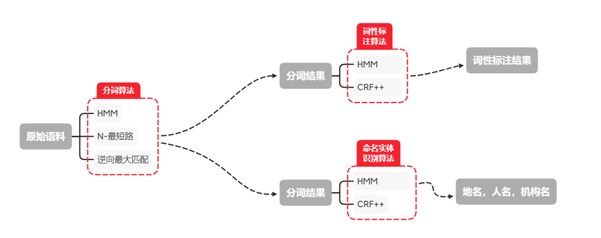

# BITCS_NLP-Project1
实现分词、词性标注以及NER
# 项目概况

本项目是一个使用 python 实现的词法分析工具包，集成了分词，词性标注以及命名实体识别等功能。项目处理流程如上图所示。

对于分词，本项目提供了三种不同的算法实现：隐马尔可夫(HMM)，N-最短路和逆向最大匹配。其中隐马尔可夫是基于统计的算法，而 N-最短路及逆向最大匹配均是基于词典的算法。

对于词性标注，本项目提供了两种算法实现，HMM 和条件随机场(CRF++)。其中 CRF++使用 python 作为胶水语言，调用底层的开源 C++接口，拥有较高的效率。

对于命名实体识别(NER)，本项目同样提供了 HMM 和 CRF++的两种实现。
